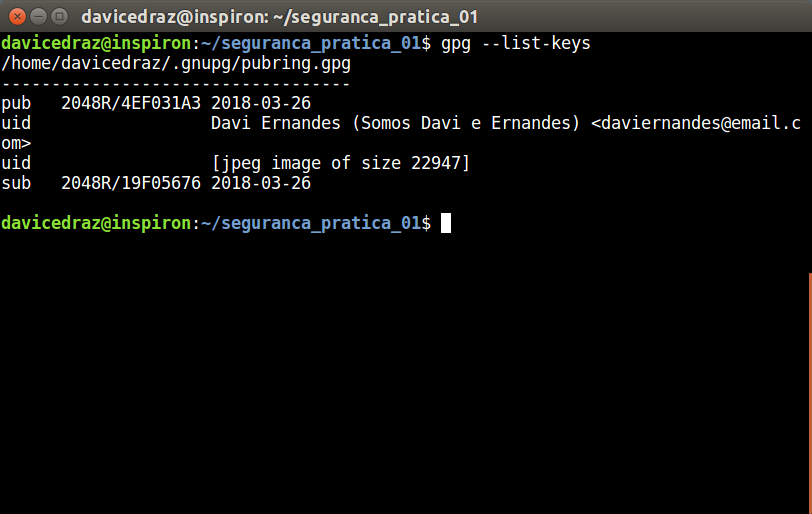
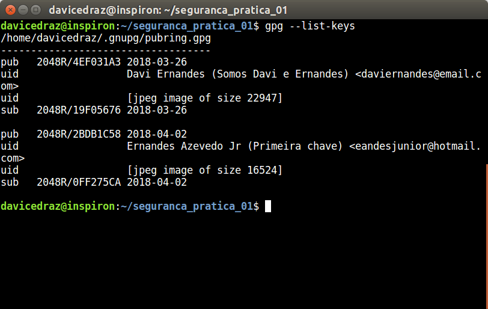
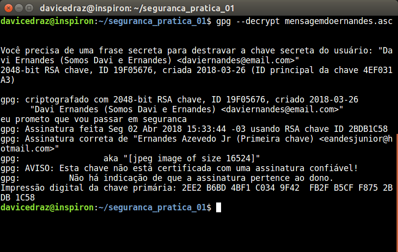
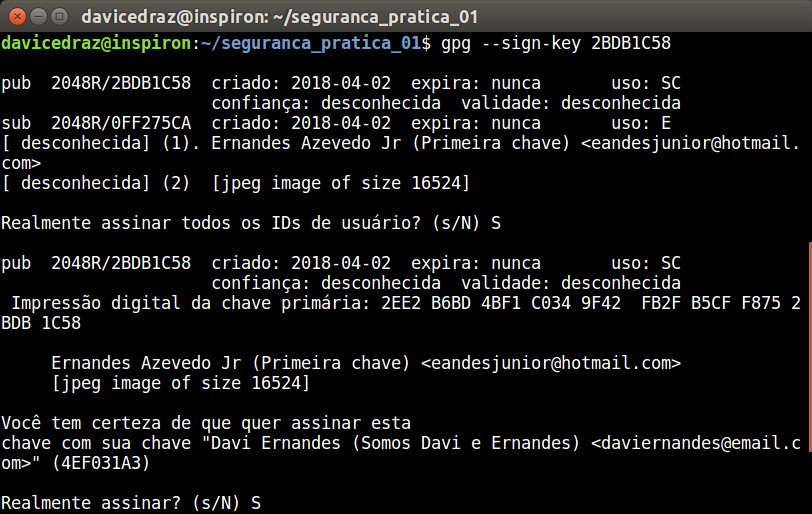
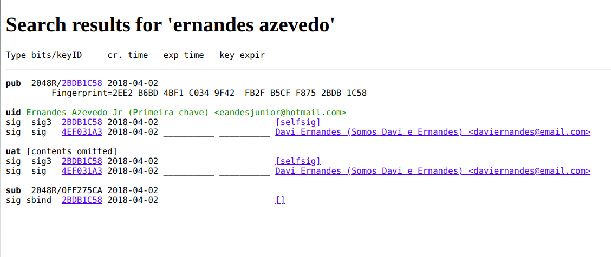
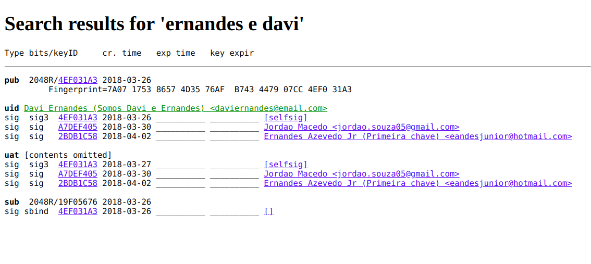
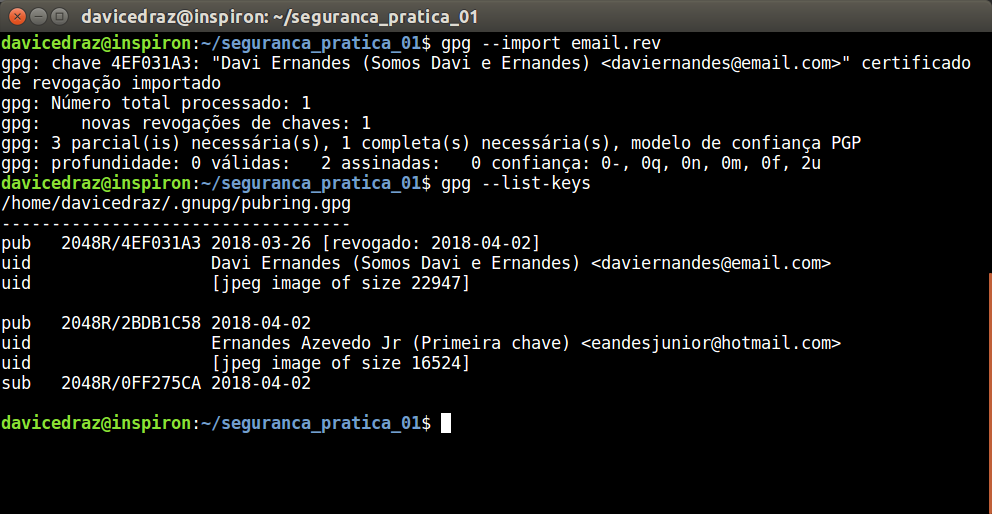

# Prática com GPG

- Esta atividade foi feita em dupla. Dada início da aula do dia 26/03 e finalizada com o colega Ernandes Azevedo (https://github.com/ErnandesAJr)

## Relatório

Nessa atividade, gastei mais tempo na reprodução dos passos do tutorial e na resolução de problemas que encontrei durante este caminho. Demorou em torno de 4 horas para concluir todos os passos, e talvez mais algumas para alinhar tudo com meu colega, pois dependiámos um do outro para obter as chaves e mensagens para reproduzir o passosdo tutorial.

A prática me ajudou a entender o GPG e como usá-lo. De modo geral, não tive muitas dificuldades e consegui fazer tudo que foi proposto.

## Passos da atividade prática:

A chave foi criada através do comando:

> gpg --gen-key 

1. A chave de nome 'minhachave' foi gerada
2. O arquivo de imagem photo.jpg foi adicionada à chave com o comando: 

> gpg --edit-key

Através do comando:
> gpg --send-keys
3. A chave foi publicada no servidor de chaves e está disponível no link: http://keyserver.ubuntu.com/pks/lookup?op=get&search=0x447907CC4EF031A3

Através do comando:
> gpg -minhachave --export

4. Foi feita a exportação da chave criada para o arquivo 'minhachave'

Através dos comandos:

> echo esta mensagem e para o ernandes > mensageparaernandes

> gpg --clearsign mensageparaoernandes

> gpg --armor --recipient eandesjunior@hotmail.com --encrypt --sign mensageparaernandes

5. O arquivo 'mensageparaernandes.asc' foi criado e a mensagem foi enviada para o Ernandes

6. O arquivo 'mensageparaoernandes.asc' contém o texto escrito com a minha assinatura digital que comprova que eu gerei o texto.

7. A chave do Ernandes foi encontrada no servidor de chaves pública: https://keyserver.ubuntu.com/pks/lookup?op=get&search=0xB5CFF8752BDB1C58

8. A chave do Ernandes foi armazenada no arquivo 'chaveernandes.txt'

Através do comando:
> gpg --import chaveernandes.txt

9. A chave do Ernandes foi importada: 

10. A mensagem do Ernandes foi enviada para mim e armazernada no arquivo 'mensagemdoernandes.asc'

Através dos comandos:

> gpg --decrypt mensagemdoernandes.asc

11. A mensagem do Ernandes foi descriptografada:

12. Como a chave do Ernandes foi anteriormente importada no passo 9. ela pôde ser verificada:

> gpg --fingerprint 2BDB1C58

13. E logo após, a chave pública do Ernandes foi assinada por mim, confirmando que certifico que a chave pertence a ele:

> gpg --sign-key 2BDB1C58

Através do comando:

> gpg --keyserver hkp://keyserver.ubuntu.com --send-key 2BDB1C58

13. A chave pública do ernandes foi enviada de volta para o servidor, agora com minha assinatura e certificado de confiança:

#### * Todos os passos das atividade foram realizados pelo meu colega, o que resultou na assinatura da minha chave pública:

Através do comando:

> gpg --gen-revoke -o email.rev 4EF031A3

14. Foi gerado o certificado de revogação 'email.rev'

Por fim, através do comando:

> gpg --import email.rev

15. O certificado de revogação foi importado e a minha chave pública foi revogada 

